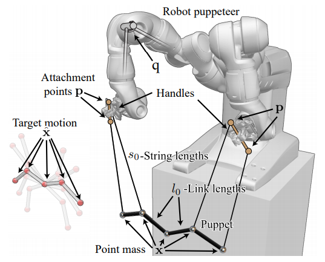

I have been fascinated with Physics-based animation for a while now. Particularly with [Soft Body Mechainics](https://paritosh-sharma.com/mass-spring-simulator/). I started learning mass-spring simulators a few months ago. A couple of days ago, I came across a fascinating research area in the field of physics-based animation and robotics which deals with the simulation of real-world puppets. 

A group of scientists at ETH Zurich introduced us to a robotic system that simulates real-world string puppets or marionettes. [“PuppetMaster”](http://crl.ethz.ch/papers/puppetMaster.pdf) can operate simple puppets like a puppy, snake, or even a Chinese dragon! The goal of the project can be summarized as follows.

> To Generate highly dynamic motion trajectories for string-driven physical systems using dexterous robots as puppeteers.

The challenging part of such a project is the unpredictable linkage of puppet motion with the puppeteer's movement.

# Overview

 The system is modeled to take the following inputs.
- Kinematic description of the robot puppeteer
- Design of the marionette
- Target motion

As seen in the following diagram, x represents the motion trajectory of the marionette and p is the control variable for the robot's motion.

Thus, x can be expressed as an implicit function of p. Now based on Newton's second law of motion we arrive at the following equation.

G(x, p) = 0

Furthermore, an objective function is modeled to represent the degree of resemblance of the marionette's motion to it's target and smoothness of the control actions.

O(x( p ), p)

From here on, the aim is to minimize p. First order sensitivity analysis provides an analytical expression for the Jacobian dx/dp which enables the use of first-order gradient-based methods. Unfortunately, the first order optimization converges far too slow. Hence, a second-order derivative of O with respect to p i.e. Hessian is needed for Newton's method.

Even though Newton's method converges faster than gradient descent, it requires evaluating the second-order sensitivity term and regularization of the Hessian. As an improvement to this, the researchers chose to go with a Gauss-Newton approximation for the Hessian.

Finally, an optimization algorithm is used to get the optimal p values using the Hessian or its approximation. For this, we solve for d using, Hd = -dO/dp, and then run a backtracking line search to find the step size to evaluate O(x(p), p).

# Limitations

While this research has laid a great foundation for future robotic puppeteering endeavors, researchers admit that this is just the first step in endowing robots with human-level skills. There are certain areas of improvements, some of these are,
- For now, it only works on simple puppets like a puppy or a snake.
- Certain aspects of the marionette's motion are not modeled here like string collisions, play, and friction in the mechanical joints, etc..
- The number of strings and position of attachment points is kept fixed and is calculated based on the derived equations. Thus, this system cannot work with all marionettes while a Human can.
- So far, the robot can only move in an open-loop manner.
- The system requires feedback mechanisms to recover from perturbations or drift that accumulate over time.
- There's a scope of mathematical analysis of the marionette's motions and use of robust design and control in the trajectory optimization step.

# Applications

The project aims to enable robots to manipulate various types of complex physical systems from manufacturing to hospitals or construction sites.

# Conclusion

In this work, we saw how to solve the puppeteering control problem using a second-order trajectory optimization method by leveraging the derivatives of motions(computed using sensitivity analysis) generated by a forward dynamics simulation to predict how the robot’s actions will affect the motion of the marionette.
